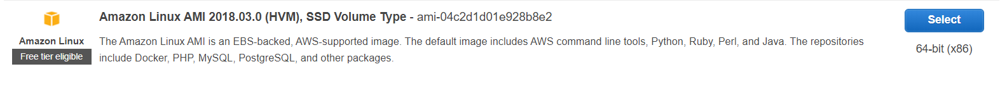
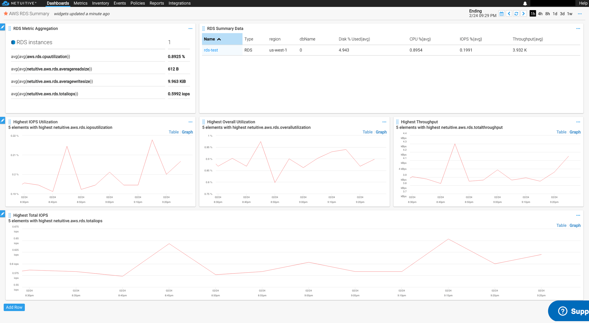
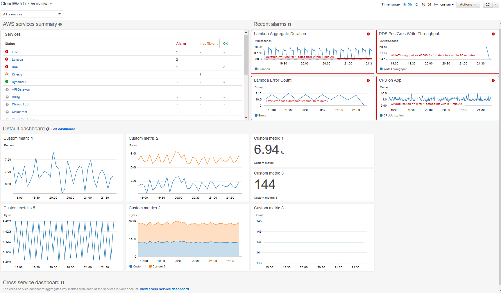

### When you host the application- it should look like below AWS hosted solution.

http://18.202.212.88/

#### Step 1 - Setup git and Clone 

### Use below image for installation:



```bash
1) sudo yum install git
2) git init
3) git clone https://github.com/Sum123it/aws-hackathon.git
```
                   
---------------------
#### Step 2 - Intall Apache httpd and mod_wsgi (https://flask.palletsprojects.com/en/1.1.x/deploying/mod_wsgi/)

```bash
1)	sudo yum install httpd
2)	sudo yum install mod_wsgi-python27.x86_64
---------------------------
```

#### Step 3 - Configure application to run with httpd

```bash
1)	sudo cp -r aws-hackathon /var/www
2)	cd /var/www ; sudo mv aws-hackathon ProjectBook
3)	cd ProjectBook  ; sudo vi welcome.conf
```

#### This configuration file enables the default "Welcome" page if there
#### is no default index page present for the root URL.  To disable the
#### Welcome page, comment out all the lines below.
#### NOTE: if this file is removed, it will be restored on upgrades.


```bash
WSGISocketPrefix /var/run/httpd  

<VirtualHost *>
   ServerName books.com
   WSGIDaemonProcess book user=ec2-user group=ec2-user threads=5 home=/var/www/ProjectBook
    WSGIScriptAlias / /var/www/ProjectBook/book.wsgi
    LogLevel debug

    <Directory /var/www/ProjectBook>
        WSGIProcessGroup book
        WSGIApplicationGroup %{GLOBAL}
        WSGIScriptReloading On
        Order deny,allow
        Allow from all
    </Directory>
</VirtualHost>
```
#### Step 4

```bash
sudo vi book.wsgi

import sys
sys.path.insert(0, '/var/www/ProjectBook/')
from book import app as application
application.debug = True

cp app.py book.py

cp welcome.conf /etc/httpd/conf.d/

sudo pip3 install -r requirements.txt
       
sudo service httpd start
```
-----------------------------------------------------


#### Step 5 :setup POSTGRESQL Database instance on Cloud (free tier)

-----------------------------------------------------------

#### Step 6:Create database and tables on DB instance


##### Setup
####	Below part base on AMI Chosen 

```bash
amazon-linux-extras install postgresql10 vim epel
yum install -y postgresql-server postgresql-devel
/usr/bin/postgresql-setup –-initdb

```
##### Start
```bash
systemctl enable postgresql
systemctl start postgresql
systemctl status postgresql
```
-----
```bash
cd /var/lib/pgsql/data
[root@ip-10-0-1-162 data]# vi  pg_hba.conf 
Replace the ‘ident’ with ‘trust’
# TYPE  DATABASE        USER            ADDRESS                 METHOD

# "local" is for Unix domain socket connections only
local   all             all                                     peer
# IPv4 local connections:
host    all             all             127.0.0.1/32            ident
# IPv6 local connections:
host    all             all             ::1/128                 ident
# Allow replication connections from localhost, by a user with the
# replication privilege.
local   replication     all                                     peer
host    replication     all             127.0.0.1/32            ident
host    replication     all             ::1/128                 ident

service postgresql restart
sudo -u postgres psql
postgres=# create database lecture;
postgres=# \c lecture    --You are now connected to database "lecture" as user "postgres".
lecture=# CREATE TABLE USERDATA (FNAME VARCHAR NOT NULL , LNAME VARCHAR NOT NULL , EMAIL TEXT NOT NULL ,USERNAME VARCHAR NOT NULL UNIQUE , PASSWORD TEXT NOT NULL);
lecture=# CREATE TABLE BOOKS (ISBN VARCHAR NOT NULL UNIQUE,TITLE VARCHAR NOT NULL,AUTHOR VARCHAR NOT NULL,PUBYEAR INTEGER NOT NULL);
lecture=# CREATE TABLE BOOK_RATING(ISBN VARCHAR NOT NULL ,USERNAME VARCHAR NOT NULL ,RATING INTEGER NOT NULL);
lecture=# CREATE TABLE BOOK_REVIEW(ISBN VARCHAR NOT NULL,USERNAME VARCHAR NOT NULL,REVIEW TEXT NOT NULL);

```
-----------------------------------------------------------------

#### Step 7:Upload Refrence data in table 'BOOKS' created in step 6

There is a file name as ‘book.csv’ in project folder you need to upload data of that csv in ‘BOOKS’ table you create in postgres

```bash
sudo -u postgres psql
 
postgres-# \c lecture
You are now connected to database "lecture" as user "postgres".
lecture-# \copy BOOKS FROM '/var/www/ProjectBook/books.csv' DELIMITER ',' CSV
COPY 5000
lecture-#
```
----------------------------------------------------------------


DONE!!!!!!!!

### Monitoring Solutions - PS -3

#### This is just for reference - You can setup your own solution for PS-3






